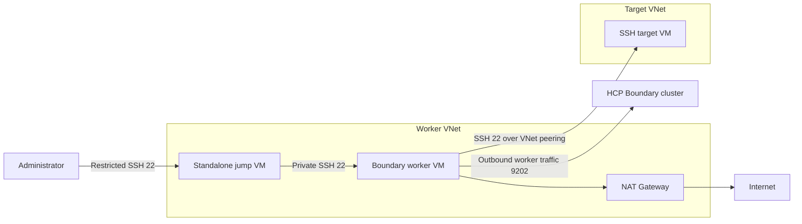

# Azure Boundary multi-hop lab

Terraform for deploying a reusable HCP Boundary multi-hop lab on Azure. The stack creates a public jump VM, a private Boundary worker, and a private SSH target connected through VNet peering.

The repository contains no environment credentials, subscription identifiers, personal usernames, public allow-list addresses, HCP cluster identifiers, or portal screenshots. Environment-specific values belong in `terraform.tfvars`, which is excluded from Git.

## Architecture



## Resources

| Layer | Resources |
|---|---|
| Resource group | Configurable destination resource group |
| Worker network | Worker VNet with separate worker and jump-host subnets |
| Target network | Target VNet and private target subnet |
| Network connection | Two VNet peering resources |
| Outbound access | StandardV2 NAT gateway and public IP associated with the worker subnet |
| Compute | Standalone jump VM, Boundary worker VM, and target VM |
| Security | Separate NSGs for the jump host, worker, and target |
| Credentials | Generated SSH key for the jump host and generated VM passwords stored only in ignored local paths and Terraform state |

The deployment does not use the Azure-managed Bastion service. Administrative access starts at the standalone jump VM.

## Prerequisites

- Terraform `>= 1.6`
- Azure CLI authenticated to the intended subscription
- Permission to create resource groups, networking, public IPs, and virtual machines
- An HCP Boundary cluster for worker registration and end-to-end testing

## Configure private values

Create an ignored variables file:

```powershell
Copy-Item terraform.tfvars.example terraform.tfvars
```

Replace all documentation values in `terraform.tfvars`. At minimum, provide:

- `subscription_id`
- `admin_source_cidr`
- The worker and target VNet/subnet CIDRs
- `hcp_boundary_cidrs`
- `hcp_boundary_cluster_id` when worker bootstrap is enabled

Do not commit `terraform.tfvars`. Prefer environment variables or a secure CI secret store for automation.

Confirm the Azure CLI context without writing an identifier into the repository:

```powershell
az login
az account set --subscription "<subscription-id>"
az account show --query "{name:name,id:id,tenantId:tenantId}" -o table
```

## Deploy

```powershell
terraform init
terraform fmt -check -recursive
terraform validate
terraform plan -out boundary-multihop.tfplan
```

Review the subscription, region, resource-group name, network ranges, and public SSH allow-list before applying:

```powershell
terraform apply boundary-multihop.tfplan
terraform output
```

No backend is configured. Local Terraform state contains generated credential material and must be protected.

## Verify the SSH path

Retrieve the generated credential-file paths locally. Do not paste their contents into tickets, logs, chat, or commits.

```powershell
terraform output -raw standalone_bastion_private_key_path
terraform output -raw worker_password_path
terraform output -raw target_password_path
```

Connect to the jump VM using the configured administrator username:

```powershell
$JumpIp = terraform output -raw standalone_bastion_public_ip
ssh -i .\.ssh\bastion-host-ed25519 "<admin-username>@$JumpIp"
```

From the jump VM, connect to the private worker address shown by `terraform output worker_private_ip`. From the worker, connect to the private target address shown by `terraform output target_private_ip`.

## Register the Boundary worker

To install and start Boundary Enterprise during the worker's first boot, set these private values in the ignored `terraform.tfvars` file:

```hcl
enable_boundary_worker_bootstrap = true
hcp_boundary_cluster_id           = "<hcp-boundary-cluster-id>"
boundary_worker_type_tags         = ["azure-intermediate"]
```

After cloud-init completes, check the worker service:

```bash
sudo systemctl status boundary-worker --no-pager
```

The worker authentication request token is sensitive. Retrieve it directly on the worker and submit it only to the intended HCP Boundary cluster. Configure the SSH target's egress worker filter to select the registered worker, then test the session from Boundary Client.

## Sensitive-data handling

- `terraform.tfvars`, `*.auto.tfvars`, state files, plan files, `.ssh/`, and `.secrets/` are excluded by `.gitignore`.
- Subscription IDs, administrator CIDRs, HCP endpoint CIDRs, and HCP cluster IDs are declared as sensitive variables without real defaults.
- Checked-in examples use reserved documentation identifiers and IP ranges only.
- Generated passwords and private keys are never committed, but they are still stored in Terraform state.
- Portal screenshots are intentionally excluded because images can contain account names, identifiers, addresses, and session details.
- For shared use, configure an encrypted remote backend with access control and state locking.

## Project layout

| Path | Purpose |
|---|---|
| `resource-group.tf` | Destination resource group |
| `vnet.tf`, `subnet.tf`, `peering.tf` | Parameterized network topology |
| `public-ip.tf`, `nat.tf` | Jump-host and worker outbound connectivity |
| `nsg.tf`, `nic.tf` | Traffic policy and VM interfaces |
| `instances.tf`, `credentials.tf` | VMs and generated credentials |
| `scripts/worker-startup.sh.tftpl` | Optional Boundary worker bootstrap |
| `terraform.tfvars.example` | Sanitized configuration template |

## Validation

```powershell
terraform fmt -check -recursive
terraform validate
tflint
terraform plan
```

## References

- [Azure MCP Server overview](https://learn.microsoft.com/en-us/azure/developer/azure-mcp-server/overview)
- [HashiCorp Terraform MCP Server](https://github.com/hashicorp/terraform-mcp-server)
- [boundary-multi-hop-azure reference project](https://gitlab.com/nyan-lin-tun/boundary-multi-hop-azure)
